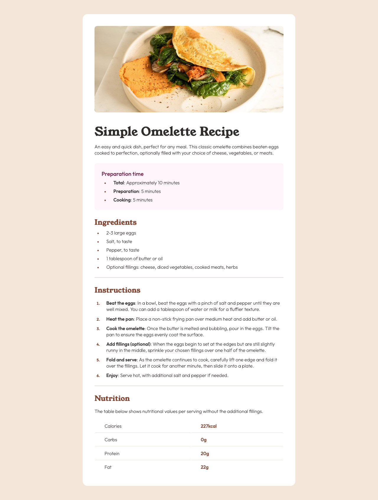

# Frontend Mentor - Recipe page solution

This is a solution to the [Recipe page challenge on Frontend Mentor](https://www.frontendmentor.io/challenges/recipe-page-KiTsR8QQKm).  

## Table of contents

- [Version Control](#version-control)
- [Overview](#overview)
  - [The challenge](#the-challenge)
  - [Screenshot](#screenshot)
  - [Links](#links)
- [Author](#author)

## Version Control
- 1.0.6 - Responsive.
- 1.0.5 - CSS Refactoring.
- 1.0.4 - HTML Refactoring.
- 1.0.3 - CSS Validation.
- 1.0.2 - HTML Validation.
- 1.0.1 - Initial Code Phase with Open Graph.
- 1.0.0 - Initialized project.

## Overview

### Screenshot

### Links

- Solution URL: https://github.com/4uwebsite/recipe-page-main 
- Live Site URL: https://4uwebsite.github.io/recipe-page-main/

## Author

- Website - https://4uwebsite.github.io/ 
- Frontend Mentor - https://www.frontendmentor.io/profile/4uwebsite 

